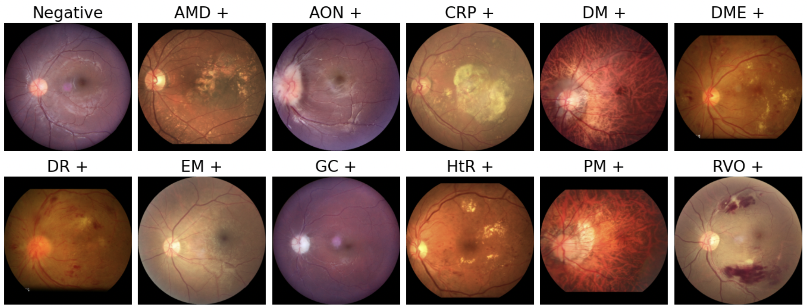

# SynFundus-1M

[](./LICENSE)

SynFundus-1M is a synthetic fundus image dataset consisting of millions of images and extensive annotations that can help improve the performance of diagnostic models.

Usage and License Notices: The data is intended and licensed for research use only.

# Demo visualize


SynFundus-1M images are annotated with 11 diseases types and 4 types of quality score. 

# Request SynFundus-1M

SynFundus-1M is for research purposes only, and researchers must comply with the CC-BY-NC-SA 4.0 agreement.

Researchers may send request via the [application form](https://forms.gle/FHRxZoAwFGGs1mEs8).

# Citation

If you find SynFundus-1M useful for your research and applications, please cite using this BibTeX:

```
@misc{shang2023synfundus,
      title={SynFundus: A synthetic fundus images dataset with millions of samples and multi-disease annotations}, 
      author={Fangxin Shang and Jie Fu and Yehui Yang and Haifeng Huang and Junwei Liu and Lei Ma},
      year={2023},
      eprint={2312.00377},
      archivePrefix={arXiv},
      primaryClass={cs.CV}
}
```

# License
The dataset is [CC-BY-NC-SA 4.0](./LICENSE) (allowing only non-commercial use) and models trained using the dataset should not be used outside of research purposes.